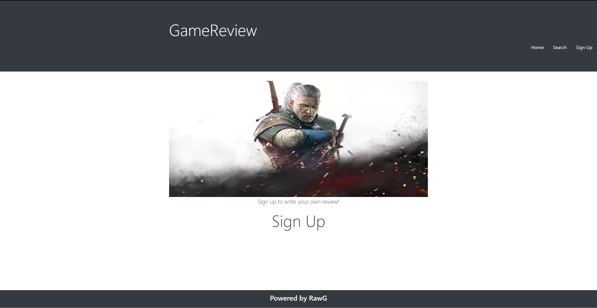
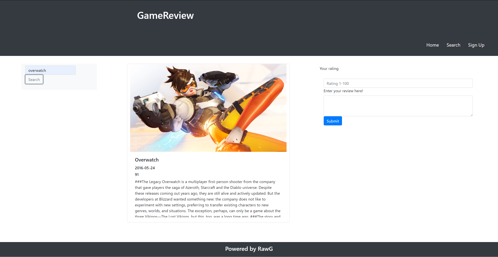

# GameReview

## Description

A place to search for and rate your favorite video games! Search games to see what others thought of a game as well as add a review expressing your own thoughts. The search page presents you with an image and description of the game you searched, as well as the ability to add your own thoughts about the game via a review section. Users are able to sign up or sign in to view their own reviews.

## Table of Contents

- [Technologies](#technologies)
- [Usage](#usage)
- [Credits](#credits)
- [License](#license)
- [Contributing](#contributing)
- [Questions](#questions)

## Technologies

- Axios
- Bcrypt npm
- dotenv npm
- Express
- express-handlebars npm
- express-session npm
- sequelize

## Usage

Gather what others think about a game you may be thinking of purchasing

## Credits

undefined

## License

This repository is under the license MIT License.
For more information see https://opensource.org/licenses/MIT

## Contributing

Contact us via email!

## Questions

Please contact us via the following methods.

- Github: https://github.com/mattjgatsby/GameReview
